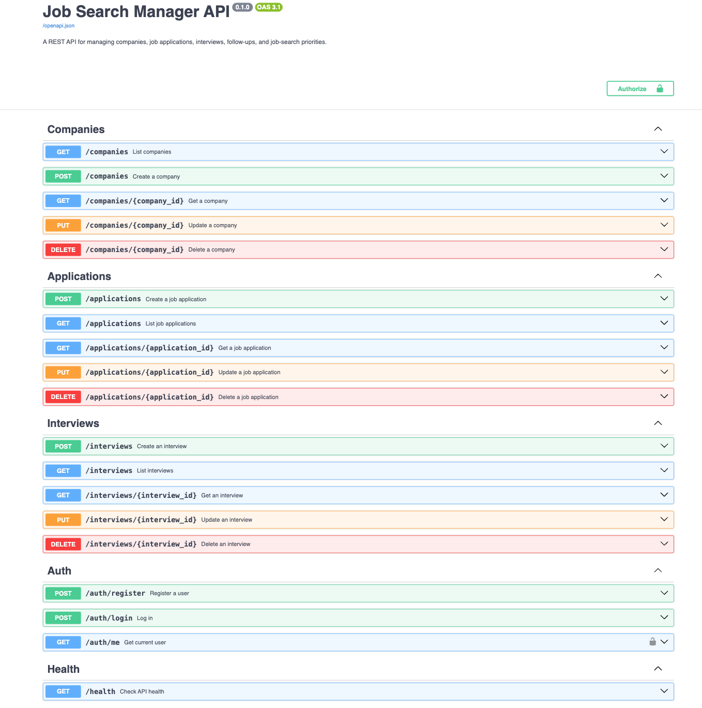
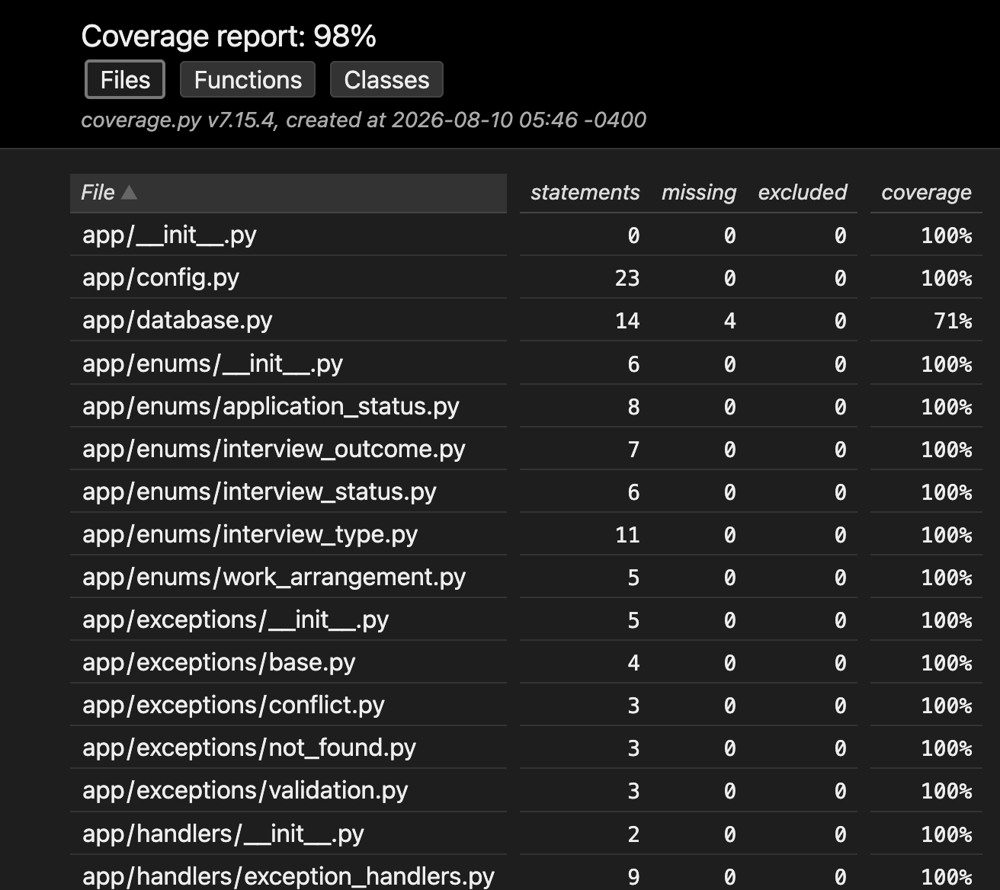
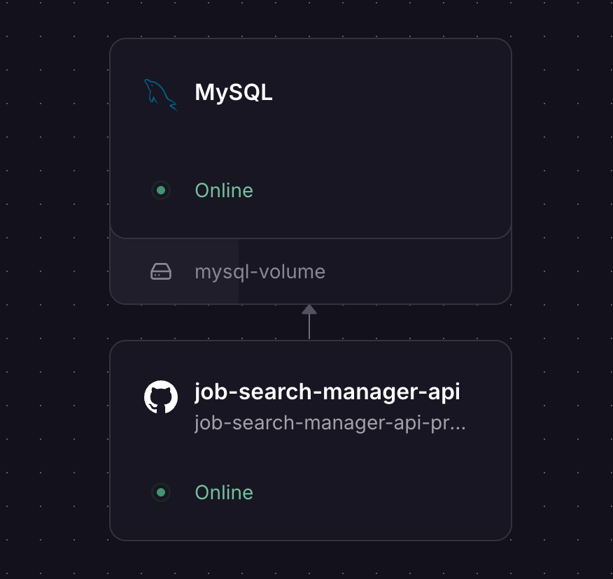

# Job Search Manager API


A production-ready REST API built with **FastAPI**, **SQLAlchemy**, and **MySQL** for managing the complete job search process. The API allows users to track companies, job applications, interviews, and authentication through secure JWT-based authorization.

The project follows a layered architecture with separate routers, services, models, and schemas, includes automated testing with high code coverage, and is deployed to Railway with a production MySQL database.

---

## Live Demo

| Resource        | URL                                                             |
| --------------- | --------------------------------------------------------------- |
| Production API  | https://job-search-manager-api-production.up.railway.app        |
| Swagger UI      | https://job-search-manager-api-production.up.railway.app/docs   |
| Health Endpoint | https://job-search-manager-api-production.up.railway.app/health |

---

## Key Features

### Company Management

- Create, update, retrieve, and delete companies
- Store company website, industry, location, and notes
- Prevent duplicate company records

### Job Application Management

- Track job applications
- Associate applications with companies
- Store salary ranges, work arrangement, application status, and notes
- Prevent duplicate job postings using unique job URLs

### Interview Management

- Schedule interviews
- Track interview type, status, and outcome
- Prevent duplicate interview scheduling
- Associate interviews with job applications

### Authentication

- User registration
- Secure password hashing with Argon2
- JWT access tokens
- Protected endpoints using HTTP Bearer Authentication

### Search & Filtering

Job Applications

- Status
- Company
- Location
- Work Arrangement
- Date Applied
- Full-text search
- Sorting
- Pagination

Interviews

- Application
- Interview Type
- Status
- Outcome
- Scheduled Date
- Sorting
- Pagination

### Validation & Error Handling

- Global exception handlers
- Request validation with Pydantic
- Duplicate resource detection
- Foreign key validation
- Date-range validation
- Consistent API error responses

### Automated Testing

- 70 automated tests
- 98% code coverage
- Dedicated MySQL test database
- CRUD endpoint testing
- JWT authentication testing
- End-to-end API workflow testing

---

## Tech Stack

### Backend

- Python 3.12+
- FastAPI
- SQLAlchemy
- MySQL
- PyMySQL

### Authentication

- PyJWT
- pwdlib (Argon2)
- HTTP Bearer Authentication

### Validation

- Pydantic
- pydantic-settings

### Testing

- Pytest
- pytest-cov
- HTTPX

### Documentation

- Swagger / OpenAPI

### Deployment

- Railway

---

## Architecture

```
Client
      │
      ▼
FastAPI Routers
      │
      ▼
Service Layer
      │
      ▼
SQLAlchemy ORM
      │
      ▼
MySQL Database
```

The application follows a layered architecture that separates routing, business logic, validation, and database access to improve maintainability and testability.

---

## Project Structure

```text
app/
│
├── models/
├── routers/
├── schemas/
├── services/
├── database.py
├── security.py
├── exceptions.py
├── handlers.py
├── config.py
└── main.py

tests/
│
├── conftest.py
├── test_auth.py
├── test_companies.py
├── test_applications.py
├── test_interviews.py
└── ...
```

---

## Screenshots

### Swagger UI



### Test Coverage Report



### Railway Deployment



## API Endpoints

### Health

| Method | Endpoint  |
| ------ | --------- |
| GET    | `/health` |

### Authentication

| Method | Endpoint         |
| ------ | ---------------- |
| POST   | `/auth/register` |
| POST   | `/auth/login`    |
| GET    | `/auth/me`       |

### Companies

| Method | Endpoint          |
| ------ | ----------------- |
| POST   | `/companies`      |
| GET    | `/companies`      |
| GET    | `/companies/{id}` |
| PUT    | `/companies/{id}` |
| DELETE | `/companies/{id}` |

### Job Applications

| Method | Endpoint             |
| ------ | -------------------- |
| POST   | `/applications`      |
| GET    | `/applications`      |
| GET    | `/applications/{id}` |
| PUT    | `/applications/{id}` |
| DELETE | `/applications/{id}` |

### Interviews

| Method | Endpoint           |
| ------ | ------------------ |
| POST   | `/interviews`      |
| GET    | `/interviews`      |
| GET    | `/interviews/{id}` |
| PUT    | `/interviews/{id}` |
| DELETE | `/interviews/{id}` |

---

## Example Requests

### Register

```http
POST /auth/register
```

```json
{
  "email": "user@example.com",
  "password": "TestPassword123!"
}
```

### Login

```http
POST /auth/login
```

```json
{
  "email": "user@example.com",
  "password": "TestPassword123!"
}
```

### Authenticated Request

```http
GET /auth/me
Authorization: Bearer <JWT>
```

---

## Local Development

### Clone

```bash
git clone <repository-url>
```

### Create a virtual environment

```bash
python3.12 -m venv .venv
source .venv/bin/activate
```

### Install dependencies

```bash
pip install -r requirements.txt
```

### Run the application

```bash
uvicorn app.main:app --reload
```

Swagger:

```
http://127.0.0.1:8000/docs
```

---

## Testing

The project includes automated tests covering:

- Authentication
- Companies
- Job Applications
- Interviews
- Validation and exception handling
- End-to-end API workflows

Run all tests:

```bash
python -m pytest
```

Generate a coverage report:

```bash
python -m pytest --cov=app --cov-report=term-missing --cov-report=html
```

Current test suite:

- **70 automated tests**
- **98% code coverage**

---

## Future Enhancements

- Refresh tokens
- Role-based authorization
- Docker support
- Alembic database migrations
- Email notifications
- Saved searches
- Application reminders
- CI/CD pipeline with GitHub Actions

---

## License

MIT
